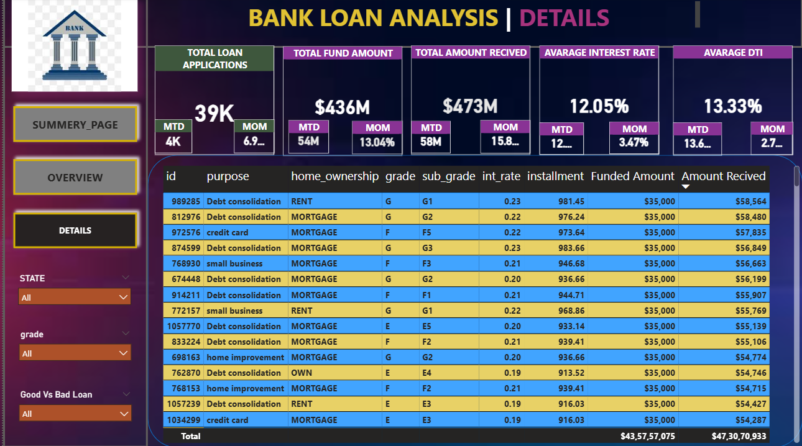

# Bank Loan Analysis | SQL + Power BI
**Project Overview**

The Bank Loan Analysis project focuses on analyzing loan application data to identify lending trends, loan performance, and customer behavior. The analysis helps evaluate loan approval patterns, repayment performance, and risk associated with different loan categories.

This project uses SQL for data querying and transformation, and interactive dashboards were developed using Microsoft Power BI to visualize key insights.

**Objectives**

* Analyze loan applications and funded amounts.

* Identify good loans vs bad loans based on loan status.

* Track monthly trends in loan issuance.

* Evaluate loan distribution by purpose, state, and term.

* Build a business intelligence dashboard for decision-making.

**Tools & Technologies**

* SQL – Data extraction and analysis

* Excel / CSV Dataset – Data source

* Microsoft Power BI – Data visualization and dashboard creation

* GitHub – Project documentation and version control

**Dataset Description**

The dataset contains information related to bank loan applications, including:

*Loan ID

*Loan Amount

*Interest Rate

*Loan Status

*Issue Date

*Customer Annual Income

*Loan Purpose

*State Information

*This dataset was used to analyze loan performance and borrower trends.

**SQL Analysis**

The following analyses were performed using SQL:

* Total Loan Applications

* Total Funded Amount

* Total Amount Received

* Loan Status Distribution

* Good Loan vs Bad Loan Percentage

* Monthly Loan Trends

* Loan Purpose Analysis

* State-wise Loan Distribution

**SQL concepts used:**

* GROUP BY

* JOIN

* CASE WHEN

* Aggregate functions (SUM, COUNT, AVG)

* Date functions

**Power BI Dashboard**

An interactive dashboard was created in Microsoft Power BI to visualize key metrics and trends.

**Key Dashboard KPIs**

* Total Loan Applications

* Total Funded Amount

* Total Amount Received

* Average Interest Rate

* Average Debt-to-Income Ratio

* Dashboard Visualizations

* Loan Status Breakdown

* Monthly Loan Trends

* Loan Purpose Distribution

* State-wise Loan Applications

* Good Loan vs Bad Loan Ratio

**Dashboard Preview**
![Dashboard]

![Dashboard]

**Project Structure**

**Bank-Loan-Analysis**

│
├── README.md
├── project.pbix
├── bank_loan.sql
├── financial_loan.csv
│
└── images
      └── dashboard.png

      
**Key Insights**

* Majority of loans fall under the Fully Paid category, indicating strong repayment behavior.

* Certain loan purposes show higher loan application rates.

* Monthly trends reveal fluctuations in loan approvals.

* Income level and loan purpose influence loan amounts and approvals.

**Author**

**Poonam Jagdale**

Aspiring Data Analyst
Skills: SQL | Excel | Power BI | Python
